# React Node InSim


[](https://www.npmjs.com/package/react-node-insim) 

A [React renderer](https://legacy.reactjs.org/docs/codebase-overview.html#renderers) for [InSim](https://en.lfsmanual.net/wiki/InSim.txt) buttons, based on [Node InSim](https://github.com/simbroadcasts/node-insim).

## Introduction

> [!WARNING]
> This project is still under development. Any API may change as needed.

React Node InSim is a [React renderer](https://legacy.reactjs.org/docs/codebase-overview.html#renderers) for [Live for Speed](https://www.lfs.net/) [InSim](https://en.lfsmanual.net/wiki/InSim.txt) buttons. It also provides [layout components](#horizontal-stack) for easier button positioning, [hooks](#hooks) for handling incoming InSim packets and tracking server connections & players.

It is based on [Node InSim](https://github.com/simbroadcasts/node-insim), a Node.js library, written in TypeScript, for InSim communication.

It allows you to create things like this:

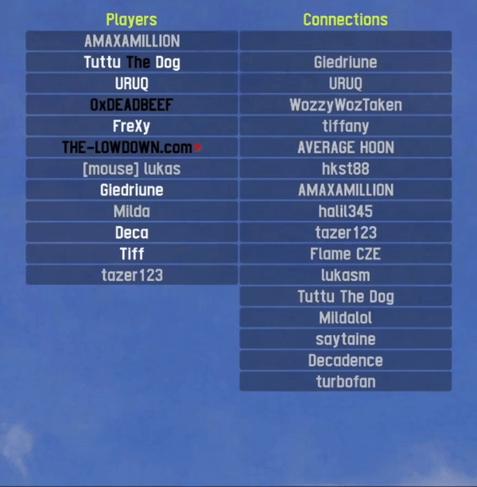

<details>
  <summary>Show source code</summary>

```tsx
import { InSim } from 'node-insim';
import type { InSimPacketInstance } from 'node-insim/packets';
import { InSimFlags, IS_MST, PacketType } from 'node-insim/packets';
import { StrictMode } from 'react';
import {
  Button,
  ConnectionsPlayersProvider,
  createRoot,
  useConnections,
  useOnConnect,
  useOnPacket,
  usePlayers,
  VStack,
} from 'react-node-insim';

function App() {
  // Get the list of current players and connections
  const players = usePlayers();
  const connections = useConnections();

  // Do something after the InSim app has been connected to LFS
  useOnConnect((packet, inSim) => {
    console.log(`Connected to LFS ${packet.Product} ${packet.Version}`);
    inSim.send(new IS_MST({ Msg: `React Node InSim connected` }));
  });

  // Handle incoming packets
  useOnPacket(PacketType.ISP_NCN, (packet) => {
    console.log(`New connection: ${packet.UName}`);
  });

  // Clickable buttons
  const handlePlayerClick =
    (plid: number) =>
    (_: InSimPacketInstance<PacketType.ISP_BTC>, inSim: InSim) => {
      inSim.send(new IS_MST({ Msg: `/echo PLID ${plid}` }));
    };

  const handleConnectionClick =
    (ucid: number) =>
    (_: InSimPacketInstance<PacketType.ISP_BTC>, inSim: InSim) => {
      inSim.send(new IS_MST({ Msg: `/echo UCID ${ucid}` }));
    };

  return (
    <>
      <Button top={10} left={40} width={30} height={5} UCID={255} color="title">
        Players
      </Button>
      <VStack
        background="dark"
        top={15}
        left={40}
        width={30}
        height={5}
        UCID={255}
      >
        {players.map((player) => (
          <Button key={player.PLID} onClick={handlePlayerClick(player.PLID)}>
            {player.PName}
          </Button>
        ))}
      </VStack>
      <Button top={10} left={70} width={30} height={5} UCID={255} color="title">
        Connections
      </Button>
      <VStack
        background="dark"
        top={15}
        left={70}
        width={30}
        height={5}
        UCID={255}
      >
        {connections.map((connection) => (
          <Button
            key={connection.UCID}
            onClick={handleConnectionClick(connection.UCID)}
          >
            {connection.UName}
          </Button>
        ))}
      </VStack>
    </>
  );
}

const inSim = new InSim();

inSim.connect({
  IName: 'React InSim',
  ReqI: 1,
  Host: '127.0.0.1',
  Port: 29999,
  Flags: InSimFlags.ISF_LOCAL,
});

const root = createRoot(inSim);

root.render(
  <StrictMode>
    <ConnectionsPlayersProvider>
      <App />
    </ConnectionsPlayersProvider>
  </StrictMode>,
);
```

</details>

## Table of contents

- [Requirements](#requirements)
- [Installation](#installation)
- [Basic usage](#basic-usage)
- [Button](#button)
  - [Placement](#placement)
  - [Sizes](#sizes)
  - [Variants](#variants)
  - [Text colors](#text-colors)
  - [Background colors](#background-colors)
- [Horizontal stack](#horizontal-stack)
- [Vertical stack](#vertical-stack)
- [Flex](#flex)
- [Grid](#grid)
- [Toggle button](#toggle-button)
  - [Variants](#variants-1)
  - [Disabled state](#disabled-state)
- [Toggle button group](#toggle-button-group)
- [Text box](#text-box)
- [Hooks](#hooks)
  - [`useOnConnect`](#useonconnect)
  - [`useOnDisconnect`](#useondisconnect)
  - [`useOnPacket`](#useonpacket)
  - [`useConnections`](#useconnections)
  - [`usePlayers`](#useplayers)
  - [`useRaceControlMessage`](#useracecontrolmessage)
  - [`useInSim`](#useinsim)
- [Scopes](#scopes)
  - [Connection scope](#connection-scope)
  - [Human player scope](#human-player-scope)
  - [Global scope](#global-scope)
- [Using React Devtools](#using-react-devtools)
- [Development](#development)

## Requirements

- [Node.js](https://nodejs.org/) 14 or higher
- [Node InSim](https://github.com/simbroadcasts/node-insim)
- [React](https://github.com/facebook/react) 18

## Installation

[NPM](https://www.npmjs.com/)

```shell
npm install react@18 node-insim react-node-insim
```

[Yarn](https://classic.yarnpkg.com/en/docs)

```shell
yarn add react@18 node-insim react-node-insim
```

[pnpm](https://pnpm.io/)

```shell
pnpm add react@18 node-insim react-node-insim
```

## Basic usage

Displaying an InSim button on a local computer

```tsx
import { InSim } from 'node-insim';
import { InSimFlags } from 'node-insim/packets';
import { Button, createRoot } from 'react-node-insim';

const inSim = new InSim();

inSim.connect({
  IName: 'React InSim',
  ReqI: 1,
  Host: '127.0.0.1',
  Port: 29999,
  Flags: InSimFlags.ISF_LOCAL,
});

const root = createRoot(inSim);

root.render(
  <Button top={100} left={80} width={30} height={10}>
    Hello InSim!
  </Button>,
);
```

You can use [React hooks](https://react.dev/reference/react) as usual to display stateful data via InSim.


```tsx
import { InSimFlags } from 'node-insim/packets';
import { useEffect, useState } from 'react';
import { Button, createRoot } from 'react-node-insim';

function App() {
  const [time, setTime] = useState(new Date());

  useEffect(() => {
    const interval = setInterval(() => {
      setTime(new Date());
    }, 1000);

    return () => {
      clearInterval(interval);
    };
  });

  return (
    <Button top={100} left={80} width={40} height={10}>
      Current time: {time.toLocaleTimeString()}
    </Button>
  );
}

const inSim = new InSim();

inSim.connect({
  IName: 'React InSim',
  ReqI: 1,
  Host: '127.0.0.1',
  Port: 29999,
  Flags: InSimFlags.ISF_LOCAL,
});

const root = createRoot(inSim);

root.render(<App />);
```

## Button

The Button component is used to display a button in LFS.

- Buttons are drawn on a 200 by 200 canvas using absolute positioning
- The maximum number of rendered buttons on a screen is 240

### Import

```ts
import { Button } from 'react-node-insim';
```

### Usage

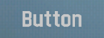

```tsx
<Button top={100} left={80} width={30} height={10}>
  Button
</Button>
```

#### Placement

Buttons use XY coordinates to position themselves on the screen. The `top` and `left` props control the button's X and Y position on the screen. The allowed range of values is 0 to 200.

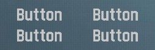

```tsx
<>
  <Button width={12} height={6} top={100} left={40}>
    Button
  </Button>
  <Button width={12} height={6} top={100} left={53}>
    Button
  </Button>
  <Button width={12} height={6} top={106} left={40}>
    Button
  </Button>
  <Button width={12} height={6} top={106} left={53}>
    Button
  </Button>
</>
```

#### Sizes

Use the `width` and `height` props to change the dimensions of the button. The allowed range of values is 0 to 200.

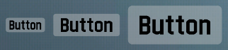

```tsx
<>
  <Button variant="light" top={100} left={40} width={6} height={4}>
    Button
  </Button>
  <Button variant="light" top={99} left={47} width={10} height={6}>
    Button
  </Button>
  <Button variant="light" top={97} left={58} width={14} height={10}>
    Button
  </Button>
</>
```

#### Variants

Use the `variant` prop to change the button's visual style. You can use `light` or `dark`. If you don't specify a variant, the button will have transparent background and a light gray text color.

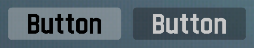

```tsx
<>
  <Button top={100} left={40} width={12} height={6} variant="light">
    Button
  </Button>
  <Button top={100} left={53} width={12} height={6} variant="dark">
    Button
  </Button>
</>
```

#### Text colors

Use the `color` prop to customize the button's text color. If you don't specify a color, the button text will be `default`.

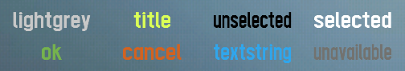

```tsx
<>
  <Button top={73} left={40} width={12} height={6} color="default">
    default
  </Button>
  <Button top={73} left={53} width={12} height={6} color="title">
    title
  </Button>
  <Button top={73} left={66} width={12} height={6} color="unselected">
    unselected
  </Button>
  <Button top={73} left={79} width={12} height={6} color="selected">
    selected
  </Button>
  <Button top={80} left={40} width={12} height={6} color="ok">
    ok
  </Button>
  <Button top={80} left={53} width={12} height={6} color="cancel">
    cancel
  </Button>
  <Button top={80} left={66} width={12} height={6} color="textstring">
    textstring
  </Button>
  <Button top={80} left={79} width={12} height={6} color="unavailable">
    unavailable
  </Button>
</>
```

You can choose from a set of semantic colors or use one of the colors from the LFS color palette.

**Semantic colors**

- default
- title
- unselected
- selected
- ok
- cancel
- textstring
- unavailable

> Note: The semantic color values can be customized in LFS Options -> Display -> Interface.

**LFS color palette**

- black
- red
- green
- yellow
- blue
- magenta
- cyan
- white

#### Background colors

Use the `background` prop to customize the button's background color. If you don't specify a color, the background will be transparent.

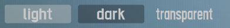

```tsx
<>
  <Button top={67} left={40} width={12} height={6} background="light">
    light
  </Button>
  <Button top={67} left={53} width={12} height={6} background="dark">
    dark
  </Button>
  <Button top={67} left={66} width={12} height={6} background="transparent">
    transparent
  </Button>
</>
```

## Horizontal stack

`HStack` displays buttons in a column without having to specify each button's position manually. You can also override button colors and sizes.

### Import

```ts
import { HStack } from 'react-node-insim';
```

### Usage

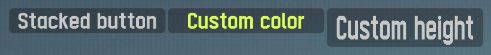

```tsx
<HStack top={10} left={20} width={7} height={4} variant="dark">
  <Button>Stacked button</Button>
  <Button color="title">Custom color</Button>
  <Button height={6}>Custom height</Button>
</HStack>
```

## Vertical stack

`VStack` displays buttons in a row without having to specify each button's position manually. You can also override button colors and sizes.

### Import

```ts
import { VStack } from 'react-node-insim';
```

### Usage

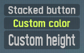

```tsx
<VStack top={10} left={20} width={7} height={4} variant="dark">
  <Button>Stacked button</Button>
  <Button color="title">Custom color</Button>
  <Button height={6}>Custom height</Button>
</VStack>
```

## Flex

Flex layout displays buttons in a row or column with flexbox options.

### Import

```ts
import { Flex } from 'react-node-insim';
```

### Usage

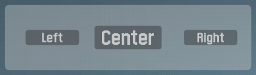

```tsx
<Flex
  top={10}
  left={20}
  width={36}
  height={16}
  alignItems="center"
  justifyContent="space-evenly"
  background="dark"
  backgroundColor="light"
>
  <Button width={8} height={4}>
    Left
  </Button>
  <Button width={10} height={6}>
    Center
  </Button>
  <Button width={8} height={4}>
    Right
  </Button>
</Flex>
```

## Grid

Grid layout displays buttons in a grid.

### Import

```ts
import { Grid, GridButton } from 'react-node-insim';
```

### Usage

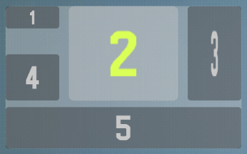

```tsx
<Grid
  top={30}
  left={40}
  width={30}
  height={30}
  background="dark"
  backgroundColor="light"
  gridTemplateColumns="1fr 2fr 1fr"
  gridTemplateRows="1fr 3fr 2fr"
  gridColumnGap={1}
  gridRowGap={1}
>
  <GridButton>1</GridButton>
  <GridButton
    gridColumnStart={2}
    gridRowStart={1}
    gridRowEnd={3}
    color="title"
    background="light"
  >
    2
  </GridButton>
  <GridButton
    gridColumnStart={3}
    gridColumnEnd={3}
    gridRowStart={1}
    gridRowEnd={3}
  >
    3
  </GridButton>
  <GridButton alignSelf="end" height={10}>
    4
  </GridButton>
  <GridButton gridColumnStart={1} gridColumnEnd={4}>
    5
  </GridButton>
</Grid>
```

## Toggle button

A button that can be toggled on and off by clicking it.

### Import

```ts
import { ToggleButton } from 'react-node-insim';
```

### Usage

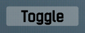

```tsx
function App() {
  const [isOn, setIsOn] = useState(false);

  return (
    <ToggleButton
      top={100}
      left={80}
      width={12}
      height={6}
      isOn={isOn}
      onToggle={setIsOn}
    >
      Toggle
    </ToggleButton>
  );
}
```

#### Variants

Use the `variant` prop to change the button's background style. You can use `light` or `dark`. If you don't specify a variant, `light` will be used.

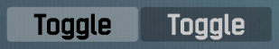

```tsx
<>
  <ToggleButton variant="light" top={100} left={40} width={12} height={6}>
    Toggle
  </ToggleButton>
  <ToggleButton variant="dark" top={100} left={53} width={12} height={6}>
    Toggle
  </ToggleButton>
</>
```

#### Disabled state

Use the `isDisabled` prop to prevent toggling the button on/off.

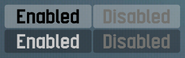

```tsx
<>
  <ToggleButton
    isDisabled={false}
    variant="light"
    top={100}
    left={40}
    width={12}
    height={6}
  >
    Enabled
  </ToggleButton>
  <ToggleButton
    isDisabled
    variant="light"
    top={100}
    left={53}
    width={12}
    height={6}
  >
    Disabled
  </ToggleButton>
  <ToggleButton
    isDisabled={false}
    variant="dark"
    top={106}
    left={40}
    width={12}
    height={6}
  >
    Enabled
  </ToggleButton>
  <ToggleButton
    isDisabled
    variant="dark"
    top={106}
    left={53}
    width={12}
    height={6}
  >
    Disabled
  </ToggleButton>
</>
```

## Toggle button group

A group of buttons that can be toggled on and off by clicking them.

### Import

```ts
import { ToggleButtonGroup } from 'react-node-insim';
```

### Usage

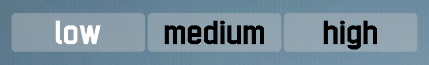

```tsx
const options = [
  { label: 'low', value: 1 },
  { label: 'medium', value: 2 },
  { label: 'high', value: 3 },
];

function App() {
  const [selectedOption, setSelectedOption] = useState(options[0]);

  return (
    <ToggleButtonGroup
      top={30}
      left={50}
      width={36}
      height={6}
      options={options}
      selectedOption={selectedOption}
      onChange={setSelectedOption}
    />
  );
}
```

## Text box

A text box whose content can span multiple rows. If the content is too long, the text box will show a scrollbar.

### Import

```ts
import { TextBox } from 'react-node-insim';
```

### Usage

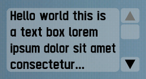

```tsx
<TextBox
  top={40}
  left={50}
  cols={20}
  rows={4}
  width={20}
  rowHeight={4}
  variant="light"
>
  Hello world this is a text box lorem ipsum dolor sit amet consectetur
  adipisicing elitrea lorem ipsum dolor sit amet consectetur adipisicing elit
</TextBox>
```

## Hooks

### `useOnConnect`

Execute code after the InSim app has been connected.

The first parameter is an `IS_VER` packet callback executed when `IS_VER` is received upon successful InSim connection to LFS.

```tsx
import { useOnConnect } from 'react-node-insim';

function App() {
  useOnConnect((packet, inSim) => {
    console.log(`Connected to LFS ${packet.Product} ${packet.Version}`);
    inSim.send(new IS_MST({ Msg: `React Node InSim connected` }));
  });

  return null;
}
```

### `useOnDisconnect`

Execute code after the InSim app has been disconnected.

The first parameter is the "disconnect" event callback from Node InSim.

```tsx
import { useOnDisconnect } from 'react-node-insim';

function App() {
  useOnDisconnect(() => {
    console.log('Disconnected from LFS');
  });

  return null;
}
```

### `useOnPacket`

Execute code when an InSim packet is received

```tsx
import { useOnPacket } from 'react-node-insim';

function App() {
  useOnPacket(PacketType.ISP_NCN, (packet) => {
    console.log(`New connection: ${packet.UName}`);
  });

  return null;
}
```

### `useConnections`

Get a live list of all connected guests.

```tsx
import { useConnections } from 'react-node-insim';

function App() {
  const connections = useConnections();

  return (
    <VStack background="dark" top={10} left={10} width={20} height={4}>
      {connections.map((connection) => (
        <Button key={connection.UCID}>{connection.UName}</Button>
      ))}
    </VStack>
  );
}
```

### `usePlayers`

Get a live list of all players on track.

```tsx
import { usePlayers } from 'react-node-insim';

function App() {
  const players = usePlayers();

  return (
    <VStack background="dark" top={10} left={10} width={20} height={4}>
      {players.map((player) => (
        <Button key={player.PLID}>{player.PName}</Button>
      ))}
    </VStack>
  );
}
```

### `useRaceControlMessage`

Send a race control message (RCM) to a connection or a player.

```tsx
import { useRaceControlMessage } from 'react-node-insim';

function App() {
  const { sendRaceControlMessageToConnection, sendRaceControlMessageToPlayer } =
    useRaceControlMessage();

  return (
    <>
      <Button
        top={5}
        left={10}
        width={15}
        height={5}
        onClick={(packet) => {
          sendRaceControlMessageToConnection(
            packet.UCID,
            'Hello from React Node InSim',
            2000,
          );
        }}
      >
        Send message to a connection
      </Button>
      <Button
        top={10}
        left={10}
        width={15}
        height={5}
        onClick={(packet) => {
          sendRaceControlMessageToPlayer(
            12, // PLID
            'Hello from React Node InSim',
            2000,
          );
        }}
      >
        Send message to a player
      </Button>
    </>
  );
}
```

### `useInSim`

Access to Node InSim API of the current InSim client instance.

```tsx
import { useInSim } from 'react-node-insim';

function App() {
  const inSim = useInSim();

  useEffect(() => {
    inSim.send(new IS_MST({ Msg: 'App mounted' }));
  }, []);

  return null;
}
```

## Scopes

If you needed to show personalised buttons for each connection or each human player on track, you would need to map over the list of connections/players and pass the correct UCIDs to each button manually. Scopes help in such use cases.

### Connection scope

You can show different buttons to each connection by wrapping a sub-tree in a `ConnectionScopeProvider`, then using the `useConnectionScope` hook anywhere within that sub-tree to access the connection object.

You don't need to specify the button's UCID in the scope - the correct UCID will be injected automatically.

```tsx
import {
  Button,
  ConnectionScopeProvider,
  useConnectionScope,
} from 'react-node-insim';

function App() {
  return (
    <ConnectionScopeProvider>
      <UserNameButton />
    </ConnectionScopeProvider>
  );
}

function UserNameButton() {
  const { UName } = useConnectionScope();

  return (
    <Button top={0} left={80} height={5} width={25}>
      {UName}
    </Button>
  );
}
```

### Human player scope

You can show different buttons to each human player on track by wrapping a sub-tree in a `HumanPlayerScopeProvider`, then using the `useHumanPlayerScope` hook anywhere within that sub-tree to access the player object.

You don't need to specify the button's UCID in the scope - the correct UCID will be injected automatically.

```tsx
import {
  Button,
  HumanPlayerScopeProvider,
  useHumanPlayerScope,
} from 'react-node-insim';

function App() {
  return (
    <HumanPlayerScopeProvider>
      <PlayerNameButton />
    </HumanPlayerScopeProvider>
  );
}

function UserNameButton() {
  const { PName } = useHumanPlayerScope();

  return (
    <Button top={0} left={80} height={5} width={25}>
      {PName}
    </Button>
  );
}
```

### Global scope

You can show the same set of buttons to all connections wrapping a sub-tree in a `GlobalScopeProvider`.

You don't need to specify the button's UCID in the scope - the correct UCID value of 255 will be injected automatically.

```tsx
import { Button, GlobalScopeProvider } from 'react-node-insim';

function App() {
  return (
    <GlobalScopeProvider>
      <Button top={0} left={80} height={5} width={40}>
        React Node InSim
      </Button>
    </GlobalScopeProvider>
  );
}
```

## Using React Devtools

React Node InSim supports [React Devtools](https://github.com/facebook/react/tree/master/packages/react-devtools) out of the box. To enable integration with React Devtools in your application, first ensure you have installed the optional `react-devtools-core` dependency, and then run your app with the `DEV=true` environment variable:

```shell
DEV=true npm start
```

Then, start React Devtools itself:

```shell
npx react-devtools
```

After it starts, you should see the component tree of your InSim app. You can even inspect and change the props of components, and see the results immediately in LFS, without restarting it.

## Development

### Requirements

- [Node.js 18](https://nodejs.org/)
- [Yarn v1](https://classic.yarnpkg.com/)
- [Live for Speed](https://www.lfs.net/)

### Installation

```shell
yarn
```

### Run example app

```shell
yarn start
```

### Lint code

```shell
yarn lint
```

### Format code

```shell
yarn format
```

---


