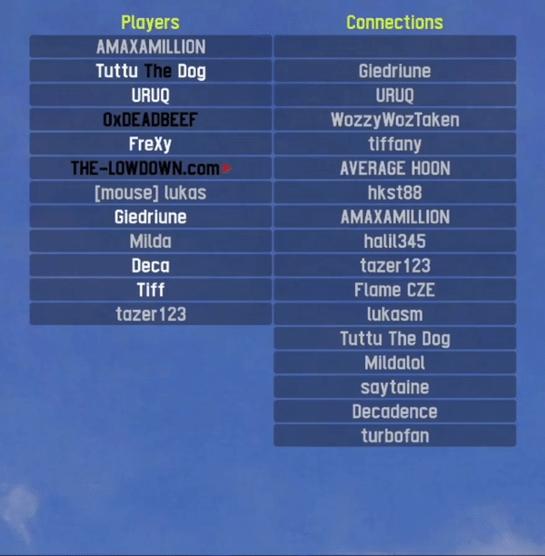

# React Node InSim

React Node InSim is a [React renderer](https://legacy.reactjs.org/docs/codebase-overview.html#renderers) for [Live for Speed](https://www.lfs.net/) [InSim](https://en.lfsmanual.net/wiki/InSim.txt) buttons. It provides layout components for easier button positioning, hooks for handling incoming InSim packets and for getting a live list of connections & players.

It is based on [Node InSim](https://github.com/simbroadcasts/node-insim), a Node.js library for InSim communication.

## What can it do?

The following example displays a live list of players and connections as InSim buttons:



```tsx
import type { InSim } from 'node-insim';
import { InSimFlags, IS_BTC, IS_MST, PacketType } from 'node-insim/packets';
import { StrictMode } from 'react';
import {
  Button,
  ConnectionsProvider,
  createRoot,
  PlayersProvider,
  useConnections,
  useOnConnect,
  useOnPacket,
  usePlayers,
  VStack,
} from 'react-node-insim';

const root = createRoot({
  name: 'React InSim',
  host: '127.0.0.1',
  port: 29999,
  flags: InSimFlags.ISF_LOCAL,
});

root.render(
  <StrictMode>
    <PlayersProvider>
      <ConnectionsProvider>
        <App />
      </ConnectionsProvider>
    </PlayersProvider>
  </StrictMode>,
);

function App() {
  // Get the list of current players and connections
  const players = usePlayers();
  const connections = useConnections();

  // Do something after the InSim app has been connected to LFS
  useOnConnect((packet, inSim) => {
    console.log(`Connected to LFS ${packet.Product} ${packet.Version}`);
    inSim.send(new IS_MST({ Msg: `React Node InSim connected` }));
  });

  // Handle incoming packets
  useOnPacket(PacketType.ISP_NCN, (packet) => {
    console.log(`New connection: ${packet.UName}`);
  });

  // Clickable buttons
  const handlePlayerClick = (plid: number) => (_: IS_BTC, inSim: InSim) => {
    inSim.send(new IS_MST({ Msg: `/echo PLID ${plid}` }));
  };

  const handleConnectionClick = (ucid: number) => (_: IS_BTC, inSim: InSim) => {
    inSim.send(new IS_MST({ Msg: `/echo UCID ${ucid}` }));
  };

  return (
    <>
      <Button top={10} left={40} width={30} height={5} UCID={255} color="title">
        Players
      </Button>
      <VStack
        variant="dark"
        top={15}
        left={40}
        width={30}
        height={5}
        UCID={255}
      >
        {players.map((player) => (
          <Button key={player.PLID} onClick={handlePlayerClick(player.PLID)}>
            {player.PName}
          </Button>
        ))}
      </VStack>
      <Button top={10} left={70} width={30} height={5} UCID={255} color="title">
        Connections
      </Button>
      <VStack
        variant="dark"
        top={15}
        left={70}
        width={30}
        height={5}
        UCID={255}
      >
        {connections.map((connection) => (
          <Button
            key={connection.UCID}
            onClick={handleConnectionClick(connection.UCID)}
          >
            {connection.UName}
          </Button>
        ))}
      </VStack>
    </>
  );
}
```

## Requirements

- Node.js
- React 18
- Node InSim

## Installation

NPM

```shell
npm install --save react-node-insim node-insim react
```

Yarn

```shell
yarn add react-node-insim node-insim react
```

pnpm

```shell
pnpm add react-node-insim node-insim react
```

## Development

### Requirements

- Node.js 18
- Yarn 1
- LFS

### Installation

```shell
yarn
```

### Run example app

```shell
yarn start
```

### Lint code

```shell
yarn lint
```

### Format code

```shell
yarn format
```
